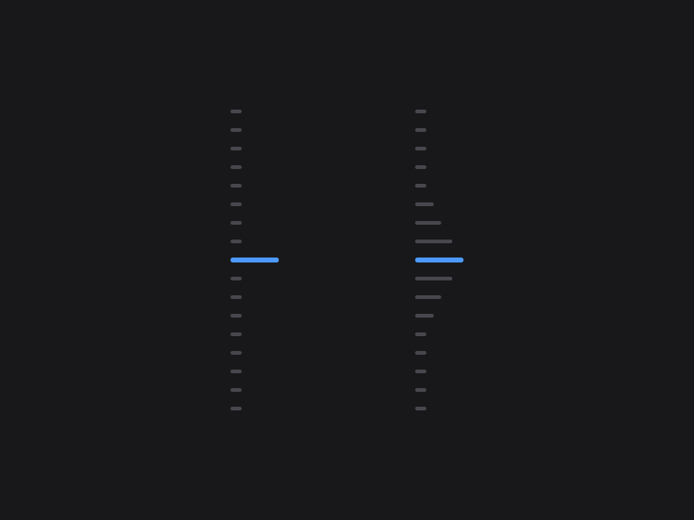

<p align="center"><a href="README.zh.md">中文</a> | English</p>

<h1 align="center">navbar</h1>

<p align="center">Conversation node navigation rail: jump between user messages from the node strip on the right edge of the conversation — hover to preview, click to jump</p>

<p align="center">
  
</p>

An evenly spaced node strip along the right edge of the conversation area (one node per user message): the active pill follows your reading position, hovering shows a preview card (truncated at 6 lines), clicking smooth-scrolls with a brand-blue highlight ring, more than 11 nodes automatically switch to a sliding window, it stays invisible until hovered, and it auto-hides when there are fewer than 2 user messages. Implements the dsh-external/issues#144 spec. Form: an official **bundle plugin** (`dsh.bundle` + dshClient channel, **browser-only**, empty Node half), 0 patches.

## Preview



## Features

| Feature | Description |
|---|---|
| Node navigation rail | Vertical node strip on the right edge of the conversation area, one dot node per user message |
| Follows reading position | The active pill (22px brand-blue capsule) moves with your current reading position |
| Hover preview | Hovering a node shows a message preview card (6-line truncation, matching the official HoverCard look) |
| Continuous hover | The entire rail (including the gaps between nodes) responds to hover continuously: the preview switches to the nearest node and the corresponding pill elongates (gray) to indicate the click target — no dead zones |
| Scroll-wheel switching | With the cursor over the rail, scrolling the wheel moves up/down one message (blocking conversation-area scrolling) |
| Click to jump | The whole rail is clickable (including gaps, jumping to the nearest node) plus an enlarged pill hit area — no need to precisely aim at tiny dots |
| Sliding window | When there are more than 11 nodes, only the nodes inside the window are shown (avoids overflow) |
| Auto-hide | Not shown with fewer than 2 user messages or on non-conversation pages |
| Message pin | 📌 button on the assistant action bar (between copy and Good response); pinned turns render as a golden slim elliptical disc in the rail (always visible, the preview card carries a 📌 badge, clicking jumps straight to the pinned reply), persisted per session |

Zero data-channel dependencies: driven only by official anchor attributes (`data-time-hover-root`, on user rows since 0806) — no polling, no routing, no tools.

## Installation

**Recommended: one-line install from git source** (build artifacts are committed, so git source does not trigger a build):

```sh
dsh plugin --profile web add "github:vlln/dsh-navbar#main"   # one-line git-source install (build artifacts committed)
# or npm source: dsh plugin --profile web add @vlln/dsh-navbar@0.3.0
```

Or from a local directory (when you have the source): `git clone`, then `cd dsh-navbar && dsh plugin --profile web add .`.

**Restart web** after installing for it to take effect; you can disable/enable it in the Plugins panel on the Settings page.

## Usage

Works out of the box — no commands, no tools. The node rail appears on the right edge of the conversation page (Chat view); hover for a preview, click to jump. Animations are disabled under `prefers-reduced-motion`.

**Pin**: hover an assistant message's action bar and click 📌 to pin that reply — the corresponding turn's navigation node becomes a golden slim elliptical disc (click to jump straight to that reply; the preview card shows a 📌 badge and the reply text). Pin state is saved per session in browser localStorage and survives refreshes; click again to unpin.

## Development

```sh
pnpm install
pnpm run build      # tsdown: client bundle (lib/client.js)
```

- client: `src/client/index.ts` (self-rendered DOM + official anchor contract; the pin button uses the official `conversation.chat.assistant-actions` slot, with React provided by the client runtime; ctx services accessed must be declared in the plugin object's `inject`)
- Node half: `src/index.mjs` (empty apply, the bundle mount carrier)

## License

MIT License (an example plugin in the DSH ecosystem).
